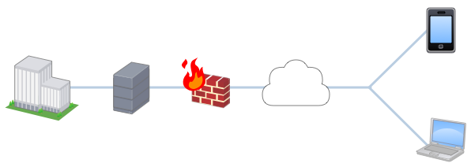

 


## Project Information

::: {.list-table header-rows=0 aligns="l,l"}
Project Detail

- - Project Name
  - Example Security Assessment

- - Dates
  - StartDate (YYYY/MM/DD) - EndDate (YYYY/MM/DD)

- - Engagement Type
  - Red Team

- - Classification
  - Confidential
:::

::: {.list-table header-rows=0 aligns="l,l,l"}
Penetration Testers

- - Technical Lead^[Role]
  - Security Engineer
  - lead@example.invalid

- - Assessment Tester
  - Security Engineer
  - tester@example.invalid

- - Assessment Director
  - Director
  - director@example.invalid
:::

::: {.list-table header-rows=0 aligns="l,l"}
Distribution List

- - Customer Representative
  - customer@example.invalid

- - Customer Representative
  - customer-2@example.invalid
:::



## Executive Summary

Lorem ipsum dolor sit amet consectetur adipiscing elit. Quisque faucibus ex sapien vitae pellentesque sem placerat. In id cursus mi pretium tellus duis convallis. Tempus leo eu aenean sed diam urna tempor. Pulvinar vivamus fringilla lacus nec metus bibendum egestas. Iaculis massa nisl malesuada lacinia integer nunc posuere. Ut hendrerit semper vel class aptent taciti sociosqu. Ad litora torquent per conubia nostra inceptos himenaeos.

Lorem ipsum dolor sit amet consectetur adipiscing elit. Quisque faucibus ex sapien vitae pellentesque sem placerat. In id cursus mi pretium tellus duis convallis. Tempus leo eu aenean sed diam urna tempor. 

Lorem ipsum dolor sit amet consectetur adipiscing elit. Quisque faucibus ex sapien vitae pellentesque sem placerat. In id cursus mi pretium tellus duis convallis. Tempus leo eu aenean sed diam urna tempor. 

::: {#tbl-finding}

{{generate-finding-table}}

Summary of Findings
:::

<!-- spacer:120 -->

Lorem ipsum dolor sit amet consectetur adipiscing elit. Quisque faucibus ex sapien vitae pellentesque sem placerat. In id cursus mi pretium tellus duis convallis. Tempus leo eu aenean sed diam urna tempor. 

::: {#tbl-severity .list-table header-rows=0 aligns="l,l,l,l,l,l"}
Severity Count with Remediation Timeline (Days)

- - **Severity**
  - Critical
  - High
  - Medium
  - Low
  - Informational

- - **Count**
  - {{count:Critical}}
  - {{count:High}}
  - {{count:Medium}}
  - {{count:Low}}
  - {{count:Informational}}

- - **Timeline**
  - 30
  - 30
  - 90
  - 120
  - N/A
:::

<!-- spacer:120 -->

Lorem ipsum dolor sit amet consectetur adipiscing elit. Quisque faucibus ex sapien vitae pellentesque sem placerat. In id cursus mi pretium tellus duis convallis. Tempus leo eu aenean sed diam urna tempor. 



## System Description

Lorem ipsum dolor sit amet consectetur adipiscing elit. Quisque faucibus ex sapien vitae pellentesque sem placerat. In id cursus mi pretium tellus duis convallis. Tempus leo eu aenean sed diam urna tempor. Pulvinar vivamus fringilla lacus nec metus bibendum egestas. Iaculis massa nisl malesuada lacinia integer nunc posuere. Ut hendrerit semper vel class aptent taciti sociosqu. Ad litora torquent per conubia nostra inceptos himenaeos.

{#fig-diagram width="7in"}

Lorem ipsum dolor sit amet consectetur adipiscing elit. Quisque faucibus ex sapien vitae pellentesque sem placerat. In id cursus mi pretium tellus duis convallis. Tempus leo eu aenean sed diam urna tempor. Pulvinar vivamus fringilla lacus nec metus bibendum egestas. Iaculis massa nisl malesuada lacinia integer nunc posuere. Ut hendrerit semper vel class aptent taciti sociosqu. Ad litora torquent per conubia nostra inceptos himenaeos.

Lorem ipsum dolor sit amet consectetur adipiscing elit. Quisque faucibus ex sapien vitae pellentesque sem placerat. In id cursus mi pretium tellus duis convallis. Tempus leo eu aenean sed diam urna tempor. Pulvinar vivamus fringilla lacus nec metus bibendum egestas. Iaculis massa nisl malesuada lacinia integer nunc posuere. Ut hendrerit semper vel class aptent taciti sociosqu. Ad litora torquent per conubia nostra inceptos himenaeos.

::: {#tbl-targets-servers .list-table header-rows=0 aligns="l,l,l"}
Servers (IP Addresses | Hostnames) (if applicable)

- - x.x.x.x
  - x.x.x.x
  - x.x.x.x

- - x.x.x.x
  - x.x.x.x
  - x.x.x.x
:::

::: {#tbl-targets-urls .list-table header-rows=0 aligns="l,l"}
Application URLs and/or API Endpoints (if applicable)

- - https://www.example.com
  - https://www.example2.com
- - https://www.example3.com
  - https://www.example4.com
:::

::: {#tbl-targets-thickclients .list-table header-rows=0 aligns="l,l"}
Thick Client Applications (if applicable)

- - Example Thick Client Application 1
  - Example Thick Client Application 2
- - Example Thick Client Application 3
  - Example Thick Client Application 4
:::

::: {#tbl-targets-others .list-table header-rows=0 aligns="l,l"}
Other Target Types (if applicable)

- - Example Other Target 1
  - Example Other Target 2
- - Example Other Target 3
  - Example Other Target 4

:::



## Findings

### Patch Management (Critical) {#sec-finding-patch-management}

::: {.list-table}
- - Score
  - Vector

- - 10.0
  - CVSS:3.1/AV:N/AC:L/PR:N/UI:N/S
:::

#### Affected System(s)

- System A

#### Description

Lorem ipsum dolor sit amet consectetur adipiscing elit. Quisque faucibus ex sapien vitae pellentesque sem placerat. In id cursus mi pretium tellus duis convallis. Tempus leo eu aenean sed diam urna tempor. Pulvinar vivamus fringilla lacus nec metus bibendum egestas. Iaculis massa nisl malesuada lacinia integer nunc posuere. Ut hendrerit semper vel class aptent taciti sociosqu. Ad litora torquent per conubia nostra inceptos himenaeos.

##### Steps to Reproduce

- Step 1
- ...
- Step N

##### Evidence / Proof of Concept / Result 

Lorem ipsum dolor sit amet consectetur adipiscing elit. Quisque faucibus ex sapien vitae pellentesque sem placerat. In id cursus mi pretium tellus duis convallis. 

{#fig-pen-tester width="4in"}

Tempus leo eu aenean sed diam urna tempor. Pulvinar vivamus fringilla lacus nec metus bibendum egestas. Iaculis massa nisl malesuada lacinia integer nunc posuere. Ut hendrerit semper vel class aptent taciti sociosqu. Ad litora torquent per conubia nostra inceptos himenaeos.

#### Recommendations

Lorem ipsum dolor sit amet consectetur adipiscing elit. Quisque faucibus ex sapien vitae pellentesque sem placerat. In id cursus mi pretium tellus duis convallis. Tempus leo eu aenean sed diam urna tempor. Pulvinar vivamus fringilla lacus nec metus bibendum egestas. Iaculis massa nisl malesuada lacinia integer nunc posuere. Ut hendrerit semper vel class aptent taciti sociosqu. Ad litora torquent per conubia nostra inceptos himenaeos.

#### References

Include if applicable. 



### Weak Passwords (Critical) {#sec-finding-weak-passwords}

::: {.list-table}
- - Score
  - Vector

- - 10.0
  - CVSS:3.1/AV:N/AC:L/PR:N/UI:N/S
:::

#### Affected System(s)

- System A

#### Description

Lorem ipsum dolor sit amet consectetur adipiscing elit. Quisque faucibus ex sapien vitae pellentesque sem placerat. In id cursus mi pretium tellus duis convallis. Tempus leo eu aenean sed diam urna tempor. Pulvinar vivamus fringilla lacus nec metus bibendum egestas. Iaculis massa nisl malesuada lacinia integer nunc posuere. Ut hendrerit semper vel class aptent taciti sociosqu. Ad litora torquent per conubia nostra inceptos himenaeos.

{#fig-hacker width="4in"}

Lorem ipsum dolor sit amet consectetur adipiscing elit. Quisque faucibus ex sapien vitae pellentesque sem placerat. In id cursus mi pretium tellus duis convallis. Tempus leo eu aenean sed diam urna tempor. Pulvinar vivamus fringilla lacus nec metus bibendum egestas. Iaculis massa nisl malesuada lacinia integer nunc posuere. Ut hendrerit semper vel class aptent taciti sociosqu. Ad litora torquent per conubia nostra inceptos himenaeos.

::: {#tbl-sample-type1 .list-table aligns="l,l,l,l"}
Table Caption

- - Header 1
  - Header 2
  - Header 3
  - Header 4

- - Row 1, Col 1
  - Row 1, Col 2
  - Row 1, Col 3
  - Row 1, Col 4

- - Row 2, Col 1
  - Row 2, Col 2
  - Row 2, Col 3
  - Row 2, Col 4

- - Row 3, Col 1
  - Row 3, Col 2
  - Row 3, Col 3
  - Row 3, Col 4

- - Row 4, Col 1
  - Row 4, Col 2
  - Row 4, Col 3
  - Row 4, Col 4
:::

<!-- spacer:120 -->

##### Steps to Reproduce

- Step 1
- ...
- Step N

##### Evidence / Proof of Concept / Result 

Lorem ipsum dolor sit amet consectetur adipiscing elit. Quisque faucibus ex sapien vitae pellentesque sem placerat. In id cursus mi pretium tellus duis convallis. 

#### Recommendations

Lorem ipsum dolor sit amet consectetur adipiscing elit. Quisque faucibus ex sapien vitae pellentesque sem placerat. In id cursus mi pretium tellus duis convallis. Tempus leo eu aenean sed diam urna tempor. Pulvinar vivamus fringilla lacus nec metus bibendum egestas. Iaculis massa nisl malesuada lacinia integer nunc posuere. Ut hendrerit semper vel class aptent taciti sociosqu. Ad litora torquent per conubia nostra inceptos himenaeos.

#### References

Include if applicable. 



### SQL Injection (High) {#sec-finding-sql-injection}

::: {.list-table}
- - Score
  - Vector

- - 7.5
  - CVSS:3.1/AV:N/AC:L/PR:N/UI:N/S
:::

#### Affected System(s)

- System A

#### Description

Lorem ipsum dolor sit amet consectetur adipiscing elit. Quisque faucibus ex sapien vitae pellentesque sem placerat. In id cursus mi pretium tellus duis convallis. Tempus leo eu aenean sed diam urna tempor. Pulvinar vivamus fringilla lacus nec metus bibendum egestas. Iaculis massa nisl malesuada lacinia integer nunc posuere. Ut hendrerit semper vel class aptent taciti sociosqu. Ad litora torquent per conubia nostra inceptos himenaeos.

::: {#tbl-sample-type2 .list-table aligns="l,l,l,l"}
Table Caption

- - Header 1
  - Header 2
  - Header 3
  - Header 4

- - Row 1, Col 1
  - Row 1, Col 2
  - Row 1, Col 3
  - Row 1, Col 4

- - Row 2, Col 1
  - Row 2, Col 2
  - Row 2, Col 3
  - Row 2, Col 4

- - Row 3, Col 1
  - Row 3, Col 2
  - Row 3, Col 3
  - Row 3, Col 4

- - Row 4, Col 1
  - Row 4, Col 2
  - Row 4, Col 3
  - Row 4, Col 4
:::

<!-- spacer:120 -->

Lorem ipsum dolor sit amet consectetur adipiscing elit. Quisque faucibus ex sapien vitae pellentesque sem placerat. In id cursus mi pretium tellus duis convallis. Tempus leo eu aenean sed diam urna tempor. Pulvinar vivamus fringilla lacus nec metus bibendum egestas. 

##### Steps to Reproduce

- Step 1
- ...
- Step N

##### Evidence / Proof of Concept / Result 

Lorem ipsum dolor sit amet consectetur adipiscing elit. Quisque faucibus ex sapien vitae pellentesque sem placerat. In id cursus mi pretium tellus duis convallis. 

#### Recommendations

Lorem ipsum dolor sit amet consectetur adipiscing elit. Quisque faucibus ex sapien vitae pellentesque sem placerat. In id cursus mi pretium tellus duis convallis. Tempus leo eu aenean sed diam urna tempor. Pulvinar vivamus fringilla lacus nec metus bibendum egestas. Iaculis massa nisl malesuada lacinia integer nunc posuere. Ut hendrerit semper vel class aptent taciti sociosqu. Ad litora torquent per conubia nostra inceptos himenaeos.

#### References

Include if applicable. 



### Unauthorized Access (Medium) {#sec-finding-unauthorized-access}

::: {.list-table}
- - Score
  - Vector

- - 4.5
  - CVSS:3.1/AV:N/AC:L/PR:N/UI:N/S
:::

#### Affected System(s)

- System A

#### Description

Lorem ipsum dolor sit amet consectetur adipiscing elit. Quisque faucibus ex sapien vitae pellentesque sem placerat. In id cursus mi pretium tellus duis convallis. Tempus leo eu aenean sed diam urna tempor. Pulvinar vivamus fringilla lacus nec metus bibendum egestas. 

##### Steps to Reproduce

- Step 1
- ...
- Step N

##### Evidence / Proof of Concept / Result 

Lorem ipsum dolor sit amet consectetur adipiscing elit. Quisque faucibus ex sapien vitae pellentesque sem placerat. In id cursus mi pretium tellus duis convallis. 

::: {#fig-code-sample1}
```bash
nmap -A -T5 1.2.3.4
cat /etc/passwd | grep root
```
Code Sample 1
:::

#### Recommendations

Lorem ipsum dolor sit amet consectetur adipiscing elit. Quisque faucibus ex sapien vitae pellentesque sem placerat. In id cursus mi pretium tellus duis convallis. Tempus leo eu aenean sed diam urna tempor. Pulvinar vivamus fringilla lacus nec metus bibendum egestas. Iaculis massa nisl malesuada lacinia integer nunc posuere. Ut hendrerit semper vel class aptent taciti sociosqu. Ad litora torquent per conubia nostra inceptos himenaeos.

#### References

Include if applicable. 



### Default Password (Low) {#sec-finding-default-password}

::: {.list-table}
- - Score
  - Vector

- - 2.0
  - CVSS:3.1/AV:N/AC:L/PR:N/UI:N/S
:::

#### Affected System(s)

- System A

#### Description

Lorem ipsum dolor sit amet consectetur adipiscing elit. Quisque faucibus ex sapien vitae pellentesque sem placerat. In id cursus mi pretium tellus duis convallis. Tempus leo eu aenean sed diam urna tempor. Pulvinar vivamus fringilla lacus nec metus bibendum egestas. 

##### Steps to Reproduce

- Step 1
- ...
- Step N

##### Evidence / Proof of Concept / Result 

Lorem ipsum dolor sit amet consectetur adipiscing elit. Quisque faucibus ex sapien vitae pellentesque sem placerat. In id cursus mi pretium tellus duis convallis. 

#### Recommendations

Lorem ipsum dolor sit amet consectetur adipiscing elit. Quisque faucibus ex sapien vitae pellentesque sem placerat. In id cursus mi pretium tellus duis convallis. Tempus leo eu aenean sed diam urna tempor. Pulvinar vivamus fringilla lacus nec metus bibendum egestas. Iaculis massa nisl malesuada lacinia integer nunc posuere. Ut hendrerit semper vel class aptent taciti sociosqu. Ad litora torquent per conubia nostra inceptos himenaeos.

#### References

Include if applicable. 



### Cross-Site Scripting (Informational) {#sec-finding-cross-site-scripting}

::: {.list-table}
- - Score
  - Vector

- - N/A
  - CVSS:3.1/AV:N/AC:L/PR:N/UI:N/S
:::

#### Affected System(s)

- System A

#### Description

Lorem ipsum dolor sit amet consectetur adipiscing elit. Quisque faucibus ex sapien vitae pellentesque sem placerat. In id cursus mi pretium tellus duis convallis. Tempus leo eu aenean sed diam urna tempor. Pulvinar vivamus fringilla lacus nec metus bibendum egestas. 

::: {#fig-code-sample2}
```python
def fibonacci(n):
    if n <= 1:
        return n
    return fibonacci(n-1) + fibonacci(n-2)
```
Code Sample 2
:::

Lorem ipsum dolor sit amet consectetur adipiscing elit. Quisque faucibus ex sapien vitae pellentesque sem placerat. In id cursus mi pretium tellus duis convallis. 

##### Steps to Reproduce

- Step 1
- Step 2
- ...
- Step N

##### Evidence / Proof of Concept / Result 

Lorem ipsum dolor sit amet consectetur adipiscing elit. Quisque faucibus ex sapien vitae pellentesque sem placerat. In id cursus mi pretium tellus duis convallis. 

#### Recommendations

Lorem ipsum dolor sit amet consectetur adipiscing elit. Quisque faucibus ex sapien vitae pellentesque sem placerat. In id cursus mi pretium tellus duis convallis. Tempus leo eu aenean sed diam urna tempor. Pulvinar vivamus fringilla lacus nec metus bibendum egestas. Iaculis massa nisl malesuada lacinia integer nunc posuere. Ut hendrerit semper vel class aptent taciti sociosqu. Ad litora torquent per conubia nostra inceptos himenaeos.

#### References

Include if applicable. 



## Appendix

### Appendix A: Name

Lorem ipsum dolor sit amet consectetur adipiscing elit. Quisque faucibus ex sapien vitae pellentesque sem placerat. In id cursus mi pretium tellus duis convallis. Tempus leo eu aenean sed diam urna tempor. Pulvinar vivamus fringilla lacus nec metus bibendum egestas. 

### Appendix B: Name

Lorem ipsum dolor sit amet consectetur adipiscing elit. Quisque faucibus ex sapien vitae pellentesque sem placerat. In id cursus mi pretium tellus duis convallis. Tempus leo eu aenean sed diam urna tempor. Pulvinar vivamus fringilla lacus nec metus bibendum egestas. 

### Disclaimer

This document is a generic security assessment template. Replace placeholders and classification text before use.

The information presented in this document is provided as is and without warranty. Security assessments are a “point in time” analysis; as such, it is possible that something in the environment could have changed or there may be undiscovered issues or emerging threats since the tests reflected in this report were run. For this reason, this report should be considered a guide, not a 100% representation of the risk threatening your systems, networks and applications.